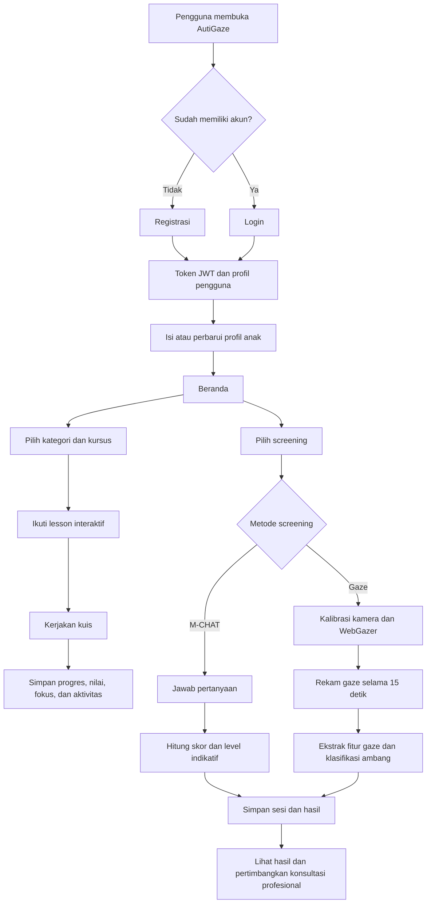
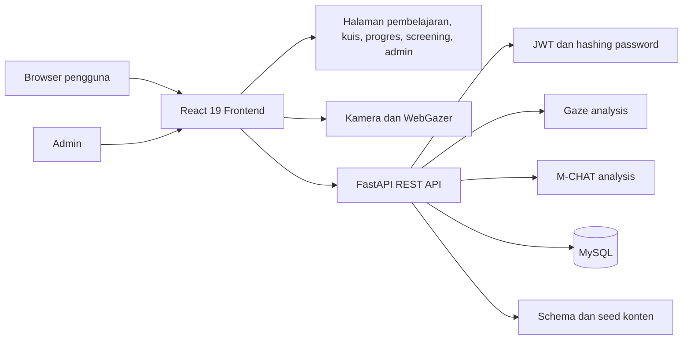
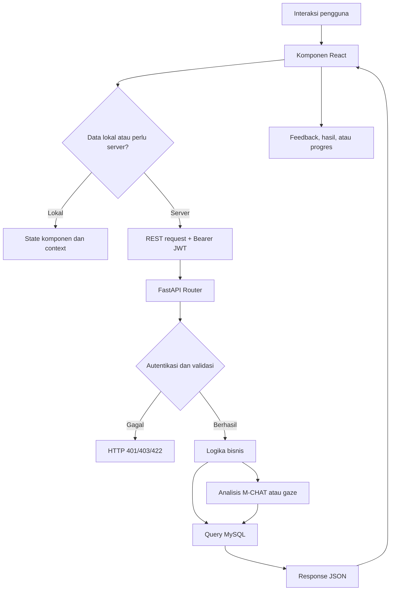
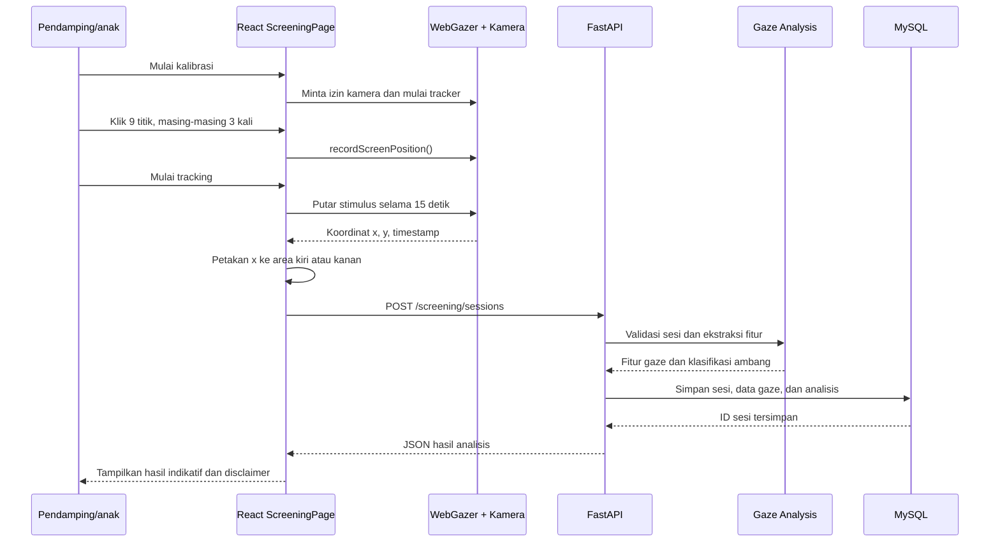
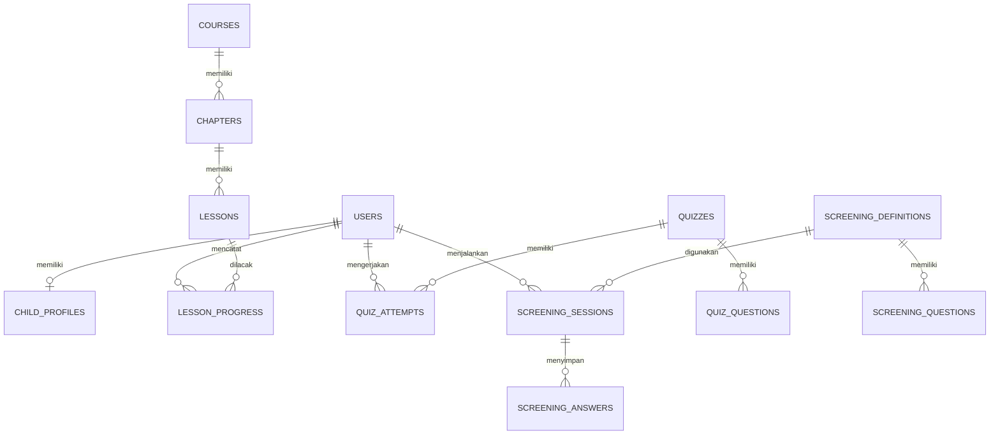
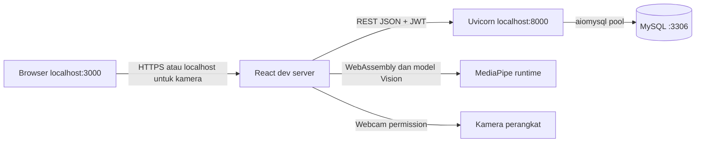

# PROPOSAL AUTIGAZE
## Platform Pembelajaran Interaktif dan Screening Indikatif untuk Anak dengan Spektrum Autisme

**Kompetisi:** BEEFEST - SDLC 2026  
**Bidang:** Computer Science: Software Engineering  
**Institusi:** BINUS @Bekasi  
**Nama tim:** _Diisi oleh peserta_  
**Anggota:** _Diisi oleh peserta_  
**Tanggal:** 24 Agustus 2026

---

## Ringkasan Proposal

AutiGaze adalah platform web yang dirancang untuk mendukung proses belajar dan pendampingan anak dengan spektrum autisme. Aplikasi ini menggabungkan materi belajar interaktif, kuis visual dan emosi, avatar 3D, pelacakan progres, pencatatan profil anak, berita edukatif, serta screening awal berbasis M-CHAT dan gaze tracking.

Nilai utama AutiGaze terletak pada penggabungan aktivitas belajar dan pemantauan perkembangan dalam satu platform. Orang tua atau pendamping dapat melihat riwayat aktivitas dan hasil screening, sedangkan anak memperoleh pengalaman belajar yang lebih visual, bertahap, dan interaktif. Screening di dalam aplikasi tidak dimaksudkan untuk menetapkan diagnosis medis. Hasilnya hanya menjadi sinyal awal yang dapat membantu menentukan apakah diperlukan observasi atau konsultasi lanjutan dengan tenaga profesional.

## 1. Pendahuluan

### 1.1 Latar Belakang

Anak dengan spektrum autisme dapat memiliki kebutuhan belajar dan pendampingan yang beragam. Materi pembelajaran yang terlalu abstrak atau tidak interaktif dapat menyulitkan anak untuk mempertahankan perhatian, memahami emosi, mengenali konsep dasar, dan melatih koordinasi tubuh. Pada saat yang sama, orang tua atau pendamping membutuhkan cara yang lebih terstruktur untuk mencatat aktivitas, melihat progres, dan memperoleh gambaran awal mengenai aspek yang perlu diperhatikan.

Dalam praktiknya, pembelajaran, pencatatan progres, informasi edukatif, dan screening sering tersedia secara terpisah. Kondisi ini dapat membuat pendamping kesulitan memperoleh gambaran perkembangan yang berkelanjutan. Dibutuhkan sebuah platform yang menyatukan pengalaman belajar anak dengan pencatatan data perkembangan secara sederhana dan mudah dipahami.

AutiGaze dikembangkan sebagai prototipe solusi untuk kebutuhan tersebut. Platform ini menyediakan kursus berdasarkan kategori visual, emosi, dan motorik. Materi dapat disajikan melalui artikel, gambar, video, visual novel, atau avatar VRM dengan animasi. Aktivitas anak dapat dilengkapi kuis dan dicatat sebagai progres. Selain itu, aplikasi menyediakan screening M-CHAT dan pengamatan gaze berbasis kamera sebagai fitur skrining indikatif.

### 1.2 Identifikasi Masalah

Masalah yang ingin dijawab oleh AutiGaze adalah:

1. Bagaimana menyediakan materi pembelajaran yang lebih visual, interaktif, dan sesuai dengan beberapa kebutuhan dasar anak dengan spektrum autisme?
2. Bagaimana membantu orang tua atau pendamping mencatat profil, aktivitas, progres pelajaran, nilai kuis, fokus, dan riwayat screening anak dalam satu platform?
3. Bagaimana menyediakan screening awal yang mudah diakses tanpa memberikan kesan bahwa hasilnya merupakan diagnosis medis?
4. Bagaimana menghubungkan data aktivitas belajar dan hasil screening dengan sistem yang aman serta dapat digunakan kembali oleh pengguna?

### 1.3 Rumusan Masalah

Rumusan masalah utama proposal ini adalah:

> Bagaimana merancang dan mengimplementasikan platform web pendampingan anak dengan spektrum autisme yang menggabungkan pembelajaran interaktif, pemantauan progres, dan screening indikatif secara terstruktur, aman, serta mudah digunakan oleh anak dan pendamping?

### 1.4 Tujuan

Tujuan pengembangan AutiGaze adalah:

1. Membangun platform pembelajaran interaktif berbasis web untuk materi visual, emosi, dan motorik.
2. Menyediakan kuis visual dan emosi untuk melatih pemahaman sekaligus mencatat hasil belajar.
3. Menyediakan profil anak dan penyimpanan progres agar pendamping dapat mengikuti perkembangan aktivitas.
4. Mengimplementasikan screening M-CHAT dan gaze tracking sebagai sinyal skrining tahap awal.
5. Menyediakan backend terpusat untuk autentikasi, penyimpanan data, analisis, dan pengelolaan konten.
6. Menjaga batasan etis dengan menampilkan disclaimer bahwa hasil screening bukan diagnosis.

### 1.5 Manfaat

**Bagi anak:**

- Mendapatkan pengalaman belajar yang lebih visual, bertahap, dan interaktif.
- Berlatih mengenali alfabet, angka, hewan, buah, alat tulis, keluarga, emosi, serta aktivitas motorik.
- Memperoleh aktivitas kuis dan materi multimedia yang dapat mendukung keterlibatan belajar.

**Bagi orang tua atau pendamping:**

- Memiliki profil dan catatan aktivitas anak dalam satu akun.
- Dapat melihat progres lesson, penyelesaian materi, fokus, aktivitas harian, streak, dan hasil kuis.
- Mendapatkan gambaran awal dari screening yang dapat menjadi bahan observasi atau konsultasi profesional.

**Bagi pengembang dan institusi pendidikan:**

- Menjadi prototipe penerapan software engineering pada domain pendidikan dan pendampingan anak.
- Menyediakan fondasi untuk pengembangan fitur analitik, personalisasi pembelajaran, dan kolaborasi dengan tenaga profesional.

### 1.6 Batasan Sistem

1. AutiGaze merupakan prototipe platform web, bukan alat diagnosis atau pengganti asesmen tenaga medis/profesional.
2. Gaze tracking berjalan melalui kamera dan WebGazer pada browser yang mendukung akses kamera serta membutuhkan kalibrasi.
3. Analisis gaze saat ini menggunakan ekstraksi fitur dan aturan ambang GeoPref; classifier machine learning belum dilatih karena belum tersedia dataset sesi berlabel.
4. Hasil screening bergantung pada kualitas kamera, pencahayaan, posisi wajah, kestabilan koneksi, dan kepatuhan pengguna terhadap instruksi.
5. Pengguna membutuhkan backend yang aktif, MySQL, serta izin kamera untuk menjalankan seluruh fitur terkait.
6. Data aplikasi dirancang untuk akun pengguna dan pendamping; pengaturan akses profesional, multi-tenant, dan integrasi rekam medis belum termasuk dalam prototipe.

## 2. Metodologi dan Perancangan

### 2.1 Metodologi Pengembangan

Metodologi yang digunakan adalah **Agile dengan pendekatan iteratif dan incremental**. Pendekatan ini dipilih karena AutiGaze memiliki beberapa modul yang dapat dikembangkan dan diuji secara bertahap, yaitu autentikasi, profil anak, katalog pembelajaran, kuis, progres, screening, dan administrasi konten.

Tahapan pengembangan:

1. **Analisis kebutuhan**: mengidentifikasi kebutuhan anak, orang tua atau pendamping, admin, serta batasan etis pada fitur screening.
2. **Perancangan**: menyusun alur pengguna, rancangan antarmuka, arsitektur client-server, endpoint API, dan skema basis data.
3. **Implementasi bertahap**: membangun frontend React, backend FastAPI, integrasi MySQL, modul screening, dan komponen multimedia.
4. **Integrasi**: menghubungkan halaman frontend dengan API melalui Axios/fetch, autentikasi JWT, penyimpanan progres, dan analisis screening.
5. **Pengujian**: melakukan smoke test API, pengujian endpoint autentikasi dan profil, pengujian unit tertentu, serta build frontend.
6. **Evaluasi dan iterasi**: meninjau kesesuaian fitur terhadap tujuan, memperbaiki alur penggunaan, dan mencatat keterbatasan prototipe untuk pengembangan berikutnya.

### 2.2 Peran Pengguna

| Peran | Kebutuhan dan hak akses |
| --- | --- |
| Anak | Mengikuti materi, visual novel, aktivitas motorik, dan kuis sesuai arahan pendamping. |
| Orang tua/pendamping | Membuat akun, mengisi profil anak, menjalankan screening, melihat progres, serta membaca berita edukatif. |
| Admin | Mengelola kursus, kategori, materi, dan berita melalui panel admin. |

### 2.3 Alur Utama Pengguna



### 2.4 Arsitektur Sistem



Frontend bertanggung jawab atas antarmuka, navigasi, pemutaran media, avatar 3D, kalibrasi, pengambilan koordinat gaze, dan pengiriman data. Backend FastAPI menangani autentikasi, validasi request, otorisasi, analisis screening, dan akses database. MySQL menyimpan data pengguna, profil anak, konten, progres, kuis, aktivitas, serta sesi screening.

#### 2.4.1 Aliran Data Aplikasi

Aliran data utama AutiGaze mengikuti pola request-response melalui REST API. Data yang berasal dari interaksi pengguna tidak langsung ditulis ke database dari browser. Frontend mengirim request ke backend, backend memvalidasi token dan payload, menjalankan logika bisnis atau analisis, kemudian menyimpan data yang lolos validasi ke MySQL.



Komunikasi menggunakan JSON. ID pengguna dan sesi dibuat dengan UUID, sedangkan relasi antar data dijaga oleh foreign key MySQL. Pendekatan ini memisahkan presentasi, logika bisnis, dan persistensi sehingga perubahan UI tidak perlu mengubah struktur penyimpanan secara langsung.

#### 2.4.2 Sequence Screening Gaze



### 2.5 Perancangan Modul

#### Modul autentikasi dan profil

- Registrasi dan login menggunakan email serta password.
- Password disimpan dalam bentuk hash menggunakan Passlib.
- Sesi pengguna menggunakan JSON Web Token dengan masa berlaku yang dikonfigurasi oleh backend.
- Endpoint `GET /api/auth/me` mengambil data pengguna aktif.
- Profil anak memuat nama, nama panggilan, usia, tanggal lahir, jenis kelamin, sekolah, kelas, hobi, dan informasi pendamping.
- Endpoint profil dan screening dilindungi oleh Bearer Token.

#### Modul pembelajaran

- Kategori awal meliputi pembelajaran visual, emosi, dan motorik.
- Kursus terdiri dari chapter dan lesson.
- Tipe lesson yang didukung meliputi VRM, gambar, video, artikel, dan visual novel.
- Lesson dapat menggunakan avatar VRM, animasi, dan estimasi gerakan tubuh melalui MediaPipe Tasks Vision.

#### Modul kuis dan progres

- Kuis memiliki pertanyaan, pilihan jawaban, kunci jawaban, skor, dan total soal.
- Penyelesaian lesson disimpan per pengguna.
- Sistem mencatat status lesson, skor fokus, event penyelesaian, event fokus, aktivitas harian, dan streak.
- Riwayat ini digunakan untuk memberikan gambaran aktivitas belajar pada halaman progres.

#### Modul screening M-CHAT

Pengguna menjawab pertanyaan dengan pilihan Ya atau Tidak. Backend membandingkan jawaban dengan `risk_answer`, menghitung jumlah jawaban berisiko, persentase risiko, level, dan kebutuhan tindak lanjut. Saat ini level ditentukan sebagai Level 1, Level 2, atau Level 3 berdasarkan persentase yang dihitung oleh modul analisis.

#### Modul screening gaze

1. Pengguna memulai persiapan dan memberikan izin kamera.
2. WebGazer melakukan kalibrasi pada sembilan titik layar, masing-masing diklik tiga kali.
3. Video stimulus diputar selama 15 detik.
4. Koordinat pandangan direkam dan dipetakan menjadi area kiri atau kanan layar.
5. Area tersebut dikaitkan dengan stimulus geometris atau sosial.
6. Backend menghitung persentase dwell time, jumlah perpindahan fokus, laju perpindahan, latensi menuju stimulus sosial, rata-rata jarak sampel, dan jumlah sampel.
7. Hasil diklasifikasikan menggunakan ambang persentase stimulus geometris sebesar 69 persen sesuai pendekatan GeoPref yang digunakan dalam prototipe.

### 2.6 Perancangan Basis Data

Entitas utama dalam basis data adalah:

- `users`: akun, role, password hash, profil ringkas anak, dan data tes.
- `child_profiles`: detail profil anak yang terhubung ke pengguna.
- `course_categories`, `courses`, `course_category_map`: katalog dan pengelompokan kursus.
- `chapters`, `lessons`: struktur materi pembelajaran.
- `quizzes`, `quiz_questions`, `quiz_attempts`, `quiz_answers`: definisi kuis dan riwayat pengerjaan.
- `lesson_progress`, `lesson_completion_events`, `focus_events`, `daily_activity`: rekaman keterlibatan dan progres belajar.
- `screening_definitions`, `screening_questions`: definisi metode dan pertanyaan screening.
- `screening_sessions`, `screening_answers`: riwayat sesi, jawaban, skor, data gaze, dan hasil analisis.
- `news_articles`: berita edukatif yang dikelola admin.

Relasi inti dapat diringkas sebagai berikut:



#### 2.6.1 Detail Relasi dan Aturan Integritas

Relasi pengguna menjadi pusat data personalisasi. Satu pengguna dapat mempunyai satu profil anak dan banyak catatan progres, percobaan kuis, aktivitas, serta sesi screening. Satu kursus terdiri atas banyak chapter, sedangkan satu chapter terdiri atas banyak lesson. Penghapusan pengguna menghapus data anak dan catatan yang bergantung padanya melalui aturan `ON DELETE CASCADE` pada relasi yang relevan.

Tabel `screening_definitions` menyimpan versi dan status publik metode screening. Pertanyaan M-CHAT disimpan terpisah di `screening_questions` sehingga definisi dapat diperbarui tanpa mengubah kode frontend. Setiap `screening_sessions` menyimpan skor, hasil, waktu, metode, dan analisis. Untuk gaze, payload mentah disimpan sebagai JSON agar koordinat dan metadata sesi tetap dapat ditinjau; fitur agregat dan klasifikasi juga disimpan agar hasil dapat ditampilkan tanpa menghitung ulang setiap kali halaman dibuka.

Kunci unik pada `users.email` mencegah akun ganda. Kunci unik pada kombinasi pengguna dan lesson mencegah duplikasi progres lesson. Kunci gabungan pada jawaban menjaga agar satu pertanyaan hanya memiliki satu jawaban dalam satu sesi. Validasi Pydantic dilakukan sebelum query database, sedangkan validasi role dilakukan sebelum endpoint admin dijalankan.

### 2.7 Desain Antarmuka Pengguna

Antarmuka menggunakan gaya ramah anak dengan warna lembut, tipografi Nunito, ikon Lucide, layout responsif, dan kartu informasi yang mudah dipindai. Halaman utama berfungsi sebagai titik akses menuju kursus, progres, berita, profil, dan screening.

Rancangan tampilan utama meliputi:

1. **Autentikasi**: halaman Sign In dan Sign Up bertahap.
2. **Beranda**: ringkasan aktivitas, akses kategori, kursus, berita, dan screening.
3. **Course dan Module**: daftar kategori, kursus, chapter, serta lesson.
4. **Lesson**: materi multimedia, avatar VRM, visual novel, animasi, dan kontrol progres.
5. **Quiz**: pertanyaan visual atau emosi, pilihan jawaban, dan hasil nilai.
6. **Screening**: alur terpisah untuk M-CHAT dan gaze dengan instruksi yang jelas.
7. **Progress**: ringkasan penyelesaian materi, fokus, aktivitas, streak, dan hasil screening.
8. **Admin**: pengelolaan CRUD kursus dan berita.

Prinsip UX yang digunakan adalah instruksi singkat, tombol aksi yang jelas, feedback setelah penyimpanan, pencegahan submit sebelum semua jawaban terisi, serta disclaimer pada fitur screening.

## 3. Eksplorasi Teknologi

### 3.1 Teknologi Frontend

| Teknologi | Pemanfaatan |
| --- | --- |
| React 19 | Membangun halaman dan komponen antarmuka berbasis komponen. |
| React Router | Navigasi halaman tanpa memuat ulang aplikasi. |
| Create React App dan CRACO | Menjalankan dan menyesuaikan konfigurasi build frontend. |
| Tailwind CSS | Styling responsif dan konsisten pada komponen UI. |
| Framer Motion | Animasi transisi dan pengalaman interaktif. |
| Radix UI dan Lucide React | Komponen aksesibilitas serta ikon antarmuka. |
| Three.js dan `@pixiv/three-vrm` | Menampilkan karakter avatar 3D berbasis VRM. |
| MediaPipe Tasks Vision | Estimasi gerakan tubuh pada lesson tertentu. |
| WebGazer | Kalibrasi kamera, prediksi koordinat gaze, dan perekaman pandangan. |
| Axios/fetch | Komunikasi antara browser dan REST API. |
| Recharts | Penyajian data progres dalam bentuk visual. |

### 3.2 Teknologi Backend

| Teknologi | Pemanfaatan |
| --- | --- |
| Python | Bahasa utama untuk layanan dan analisis data. |
| FastAPI | Framework REST API asynchronous dengan validasi berbasis Pydantic. |
| Uvicorn | Menjalankan aplikasi FastAPI. |
| MySQL dan aiomysql | Penyimpanan relasional dan koneksi database asynchronous. |
| PyJWT | Pembuatan dan validasi token autentikasi. |
| Passlib | Hashing dan verifikasi password. |
| Pydantic | Validasi payload request dan tipe data. |
| Pandas dan NumPy | Dependensi pendukung pengolahan data dan pengembangan analitik. |

### 3.3 Alasan Pemilihan Teknologi

Pemilihan teknologi didasarkan pada kebutuhan prototipe, yaitu interaksi visual, pengolahan data kamera, API yang mudah diuji, serta penyimpanan relasional.

1. **React** dipilih karena antarmuka AutiGaze terdiri dari banyak state dan alur interaksi, seperti progres lesson, pilihan jawaban, status kamera, kalibrasi, dan hasil screening. Model komponen memudahkan setiap fitur dikembangkan serta diuji secara terpisah.
2. **React Router** memisahkan halaman autentikasi, katalog, lesson, progres, screening, dan admin tanpa memuat ulang seluruh aplikasi.
3. **Three.js dan `@pixiv/three-vrm`** digunakan karena avatar VRM membutuhkan rendering 3D real-time dan pengelolaan animasi pada browser.
4. **MediaPipe Tasks Vision** menyediakan model hand dan pose landmark yang dapat berjalan dari webcam. Hasil landmark digunakan untuk menampilkan rangka tubuh/tangan serta mendeteksi gerakan lambaian dan kehilangan fokus secara heuristik.
5. **WebGazer** sesuai untuk prototipe gaze tracking berbasis webcam karena menyediakan kalibrasi dan prediksi koordinat pandangan langsung di browser, sehingga tidak memerlukan perangkat eye tracker khusus.
6. **FastAPI** dipilih karena mendukung endpoint asynchronous, dokumentasi OpenAPI otomatis, dan validasi request dengan Pydantic.
7. **MySQL** sesuai untuk data yang memiliki relasi jelas, seperti pengguna-kursus-lesson-progres dan sesi screening-jawaban.
8. **JWT** digunakan untuk autentikasi stateless antara frontend dan backend. Password tetap diverifikasi melalui hash Passlib dan tidak dikirim kembali pada response publik.

### 3.4 Rincian Teknologi Computer Vision dan Analitik

#### A. Estimasi gerakan tubuh dengan MediaPipe

Pada lesson yang mengaktifkan estimasi tubuh, browser meminta stream video melalui `getUserMedia`. `FilesetResolver` memuat runtime Vision, kemudian `HandLandmarker` dan `PoseLandmarker` memproses frame video dalam mode `VIDEO`. Landmark hasil deteksi digambar pada canvas sebagai feedback visual.

Deteksi lambaian menggunakan riwayat koordinat pergelangan tangan dalam jendela sekitar 1,2 detik. Sistem menganggap lambaian terdeteksi jika rentang gerak melewati ambang tertentu dan terdapat sedikitnya dua perubahan arah, dengan jeda antardeteksi untuk mencegah event berulang. Deteksi fokus menggunakan keberadaan landmark tangan atau pose; jika landmark tidak terdeteksi selama beberapa detik, callback pengingat fokus dipanggil.

#### B. Pemrosesan gaze

WebGazer menghasilkan koordinat layar `(x, y)` beserta timestamp. Frontend membandingkan `x` dengan garis tengah viewport:

```text
contentField = left  jika x < screenWidth / 2
contentField = right jika x >= screenWidth / 2
```

Layout stimulus kemudian menerjemahkan area kiri menjadi `geometris` dan area kanan menjadi `sosial`. Backend mengurutkan sampel berdasarkan timestamp dan menghitung jarak waktu antar sampel. Dwell time sebuah stimulus adalah akumulasi jarak waktu dari sampel stimulus tersebut menuju sampel berikutnya. Dari proses ini dihasilkan `pct_sosial`, `pct_geometris`, `saccade_count`, `saccade_rate_per_sec`, `latency_first_sosial_ms`, `avg_gaze_gap_ms`, dan `total_samples`.

Klasifikasi tahap prototipe menggunakan aturan deterministik:

```text
flagged = pct_geometris >= 69
```

Nilai 69 persen adalah ambang yang dikonfigurasi sebagai `GEOPREF_THRESHOLD_PCT`. Aturan ini dapat diaudit dan dijelaskan, tetapi belum menggantikan validasi klinis. Fungsi `classify_ml` masih berupa placeholder dan sengaja tidak digunakan sampai tersedia dataset gaze berlabel yang memadai.

#### C. Analisis M-CHAT

Backend mengambil pertanyaan yang aktif berdasarkan `definition_id`. Setiap jawaban dibandingkan dengan `risk_answer`, kemudian jumlah jawaban berisiko dibagi dengan jumlah pertanyaan untuk memperoleh persentase. Sistem mengembalikan `score`, `total`, `confidence`, `level`, `needs_follow_up`, dan `message`. Istilah `confidence` pada output merupakan persentase jawaban berisiko untuk kebutuhan tampilan prototipe, bukan probabilitas diagnosis.

### 3.5 Kontrak API dan Siklus Request

Contoh payload penyimpanan sesi screening:

```json
{
    "definition_id": "gaze-screening-v1",
    "answers": {},
    "score": null,
    "result": "Atensi visual terpantau baik",
    "gaze_session": {
        "durationSeconds": 15,
        "stimulusLayout": {"left": "geometris", "right": "sosial"},
        "calibration": [],
        "gaze": []
    }
}
```

Siklus request berlangsung sebagai berikut:

1. Frontend membentuk payload berdasarkan interaksi pengguna.
2. Header `Authorization` membawa JWT untuk endpoint terlindungi.
3. FastAPI mengurai payload ke model Pydantic dan menolak struktur yang tidak sesuai.
4. Dependency autentikasi memvalidasi signature, masa berlaku, dan keberadaan user.
5. Endpoint mengambil definisi screening dari database dan menjalankan analisis yang sesuai.
6. Backend menyimpan sesi dan mengembalikan response JSON berisi ID, skor, hasil, dan analisis.
7. Frontend memperbarui state lalu menampilkan feedback atau pesan kesalahan.

Kode status yang penting adalah `200` untuk request berhasil, `401` untuk token tidak valid atau kedaluwarsa, `403` untuk role yang tidak memiliki akses, `404` untuk definisi atau resource yang tidak ditemukan, dan `422` untuk payload gaze yang tidak valid.

### 3.6 Struktur Deployment dan Konfigurasi

Pada lingkungan pengembangan, frontend dijalankan melalui Create React App/CRACO pada port `3000`, sedangkan FastAPI dijalankan oleh Uvicorn pada port `8000`. Frontend membaca `REACT_APP_BACKEND_URL`, sementara backend membaca konfigurasi MySQL, CORS, dan secret JWT dari environment variable. Browser mengakses API melalui URL `${REACT_APP_BACKEND_URL}/api`.



Untuk deployment produksi, konfigurasi yang perlu ditambahkan adalah HTTPS, secret JWT acak, pembatasan CORS ke domain resmi, reverse proxy, backup database, logging, rate limiting, dan kebijakan retensi data screening. Kamera browser umumnya hanya dapat digunakan pada HTTPS atau `localhost`, sehingga konfigurasi ini merupakan prasyarat fitur gaze dan estimasi tubuh.

### 3.7 Endpoint dan Integrasi Utama

Semua endpoint utama menggunakan prefix `/api`. Contohnya:

- `POST /auth/register`, `POST /auth/login`, dan `GET /auth/me` untuk autentikasi.
- `PUT /users/child-data` dan `PUT /users/autism-test` untuk data anak.
- `GET /categories`, `GET /courses`, dan endpoint chapter untuk katalog pembelajaran.
- `GET /quizzes/{quiz_id}` dan `POST /quizzes/{quiz_id}/attempts` untuk kuis.
- `POST /lessons/{lesson_id}/progress` dan `GET /progress` untuk progres.
- `GET /screening/definitions`, `POST /screening/sessions`, dan `GET /screening/sessions` untuk screening.
- Endpoint `/admin/*` untuk CRUD kursus dan berita bagi pengguna dengan role admin.

### 3.8 Keamanan dan Privasi

- Autentikasi menggunakan JWT dengan header `Authorization: Bearer <token>`.
- Password tidak dikembalikan dalam response pengguna.
- Password disimpan sebagai hash, bukan plaintext.
- Endpoint data anak, progres, dan screening memerlukan autentikasi.
- Akses admin dibatasi berdasarkan role.
- Data gaze dan hasil screening disimpan sebagai bagian dari sesi pengguna yang terautentikasi.
- Konfigurasi database, CORS, dan secret JWT disediakan melalui environment variable.
- Aplikasi menampilkan batasan bahwa screening bukan diagnosis untuk mencegah salah tafsir hasil.

### 3.9 Pengujian dan Quality Check

Pengujian yang telah tersedia dalam proyek mencakup:

1. Smoke test HTTP untuk backend melalui `backend_test.py`.
2. Pengujian endpoint register, login, dan `auth/me`.
3. Pengujian token valid, token tidak valid, kredensial salah, dan duplikasi email.
4. Pengujian penyimpanan dan pembaruan data anak serta autism test.
5. Pengujian unit pada utilitas animasi tertentu di frontend.
6. Perintah build frontend melalui `npm run build`.
7. Pengujian backend dengan `pytest`, termasuk opsi eksekusi serial melalui `pytest -n 0`.

Pengujian lanjutan yang masih dibutuhkan adalah uji usability bersama pendamping, uji aksesibilitas, uji lintas browser, uji kualitas tracking pada berbagai kondisi kamera, serta validasi klinis yang melibatkan tenaga profesional.

## 4. Evaluasi Kesesuaian

### 4.1 Kesesuaian Tujuan dan Implementasi

| Tujuan | Implementasi saat ini | Status evaluasi |
| --- | --- | --- |
| Menyediakan pembelajaran interaktif | Kategori visual, emosi, motorik, lesson multimedia, avatar VRM, visual novel, dan animasi | Sesuai |
| Menyediakan evaluasi pemahaman | Kuis visual dan emosi dengan penyimpanan nilai | Sesuai |
| Mencatat perkembangan anak | Profil anak, progres lesson, fokus, aktivitas harian, streak, dan riwayat kuis | Sesuai secara fungsional |
| Menyediakan screening awal | M-CHAT dan gaze tracking dengan analisis backend | Sesuai sebagai prototipe indikatif |
| Mengamankan data pengguna | JWT, hashing password, validasi Pydantic, pembatasan role dan endpoint | Sesuai pada fondasi aplikasi |
| Menghasilkan diagnosis akurat | Tidak menjadi tujuan dan tidak diklaim oleh sistem | Sengaja dibatasi |

Secara keseluruhan, implementasi telah mencakup tujuan inti berupa pembelajaran, pendampingan, pencatatan progres, dan screening indikatif. Penyimpanan data screening dilakukan melalui `screening_sessions` dan hasil analisis dapat ditampilkan kembali pada ringkasan pengguna. Alur frontend juga memandu pengguna melalui kalibrasi sebelum gaze tracking dan mencegah pengiriman M-CHAT sebelum semua pertanyaan dijawab.

### 4.2 Kesesuaian terhadap Kebutuhan Pengguna

- **Anak** mendapatkan materi dengan unsur visual, audio/visual multimedia, avatar, kuis, dan aktivitas yang dapat disusun bertahap.
- **Pendamping** mendapatkan autentikasi, profil anak, riwayat aktivitas, hasil kuis, progres, dan hasil screening.
- **Admin** mendapatkan kemampuan mengelola konten kursus dan berita tanpa mengubah kode aplikasi.
- **Tenaga profesional** belum memiliki dashboard khusus atau integrasi data formal; hasil aplikasi hanya dapat digunakan sebagai informasi pendukung setelah memperoleh persetujuan dan interpretasi profesional.

### 4.3 Kesesuaian Hasil Screening

M-CHAT menggunakan jawaban pertanyaan dan `risk_answer` yang disimpan pada definisi screening untuk menghasilkan skor, persentase, level, dan indikator tindak lanjut. Gaze screening menggunakan data yang lebih kaya, yaitu koordinat, timestamp, layout stimulus, durasi, dan data kalibrasi. Fitur yang diekstrak mencakup:

- persentase waktu pada stimulus sosial dan geometris;
- jumlah perpindahan antara dua area stimulus;
- laju perpindahan per detik;
- latensi menuju fiksasi sosial pertama;
- rata-rata jarak antar-sampel sebagai indikator kualitas tracking; dan
- jumlah sampel gaze valid.

Klasifikasi gaze saat ini menggunakan ambang `69%` untuk persentase stimulus geometris. Karena model machine learning belum dilatih dengan dataset berlabel, hasil ini harus dipahami sebagai indikator teknis dari satu sesi, bukan ukuran klinis atau diagnosis. Perbedaan hasil dengan tujuan awal dapat terjadi karena kualitas kamera, kalibrasi, kondisi lingkungan, usia pengguna, atau variasi perilaku anak.

### 4.4 Kekuatan Prototipe

1. Menggabungkan pembelajaran dan pemantauan dalam satu platform.
2. Memiliki variasi media yang sesuai untuk pendekatan visual dan interaktif.
3. Memiliki alur autentikasi serta penyimpanan data yang jelas.
4. Menyediakan dua pendekatan screening dengan karakteristik data berbeda.
5. Menggunakan arsitektur modular sehingga fitur baru dapat ditambahkan tanpa mengubah seluruh sistem.
6. Menyertakan disclaimer dan batasan penggunaan pada fitur yang sensitif.

### 4.5 Keterbatasan dan Risiko

1. Belum ada validasi klinis terhadap ambang, level, atau interpretasi hasil screening.
2. Model ML gaze masih berupa placeholder dan belum dapat digunakan untuk prediksi berbasis dataset terlatih.
3. Akurasi gaze dipengaruhi perangkat dan lingkungan pengguna.
4. Sebagian fitur membutuhkan browser modern, koneksi yang stabil, dan izin kamera.
5. Belum tersedia pengaturan persetujuan data yang rinci, penghapusan data mandiri, audit log, dan enkripsi aplikasi tingkat lanjut.
6. Belum tersedia pengujian usability formal dengan sampel anak dan pendamping.
7. Konten pembelajaran masih perlu ditinjau oleh ahli pendidikan khusus atau terapis agar tujuan dan tingkat kesulitannya sesuai.

### 4.6 Rencana Evaluasi Lanjutan

Untuk meningkatkan kesesuaian dan keandalan sistem, evaluasi berikut direkomendasikan:

1. Melakukan usability testing dengan orang tua, pendamping, dan ahli pendidikan khusus.
2. Mengumpulkan dataset gaze yang dianonimkan dan berlabel dengan persetujuan yang sesuai.
3. Membandingkan hasil sistem dengan observasi atau asesmen profesional, tanpa menjadikan sistem sebagai pengganti diagnosis.
4. Menguji reliabilitas hasil pada sesi berulang, perangkat berbeda, dan kondisi pencahayaan berbeda.
5. Menambahkan consent management, kebijakan retensi data, ekspor data, dan penghapusan akun.
6. Menambahkan dashboard profesional dengan kontrol akses yang ketat apabila diperlukan.
7. Memperluas personalisasi materi berdasarkan usia, profil, progres, dan pola interaksi anak.

### 4.7 Kesimpulan Evaluasi

AutiGaze telah memenuhi tujuan prototipe sebagai platform pembelajaran dan pendampingan berbasis web dengan fitur screening indikatif. Hubungan antara tujuan, fitur, alur pengguna, API, dan basis data telah dirancang secara konsisten. Implementasi paling kuat berada pada integrasi pembelajaran, kuis, progres, autentikasi, dan penyimpanan riwayat.

Namun, sistem belum dapat diposisikan sebagai perangkat diagnosis. Validasi klinis, pengujian pengguna nyata, perlindungan data yang lebih lengkap, dan pengembangan model gaze berbasis dataset berlabel merupakan pekerjaan lanjutan yang penting. Dengan batasan tersebut, AutiGaze layak dipresentasikan sebagai prototipe software engineering yang menawarkan pendekatan terintegrasi untuk mendukung pembelajaran dan observasi awal anak dengan spektrum autisme.

## Lampiran: Cara Menjalankan Prototipe

Prasyarat utama: Python 3.10+, Node.js 18+, npm, dan MySQL 8 atau kompatibel.

```powershell
# Terminal backend
cd backend
python -m venv .venv
.\.venv\Scripts\Activate.ps1
pip install -r requirements.txt
uvicorn server:app --reload --host 0.0.0.0 --port 8000

# Terminal frontend
cd frontend
npm install
npm start
```

Frontend berjalan pada `http://localhost:3000`, API pada `http://localhost:8000/api`, dan dokumentasi API tersedia di `http://localhost:8000/docs`.
